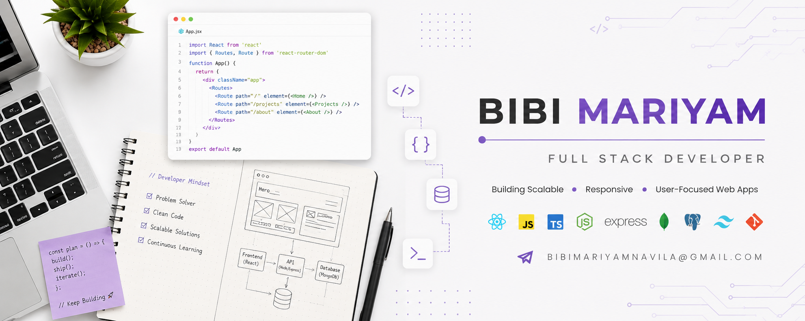

Hello , I'm Bibi Mariyam
 
 A Full Stack Developer

---
 

I love building simple, meaningful things for the web. 
This space is a small reflection of my learning journey, curiosity, and creativity. Thanks for stopping by!🌱

## About Me

- I am a passionate **Full Stack Developer** who loves turning ideas into real, working websites.
- I am exploring **Next.js** and modern JavaScript frameworks to level up my skills.
- Currently working  on various **frontend projects** and improving my real-world skills.
- Ask me about **Full-Stack (React, Next, Node, Express, MongoDB, PostgreSQL)**.

---

## Tech Stack

### Frontend

### Backend & Database

### Tools & Deployment

## Connect With Me

## GitHub Stats

<!--  -->

